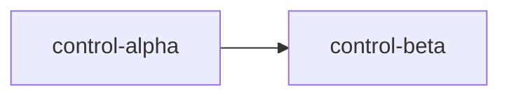
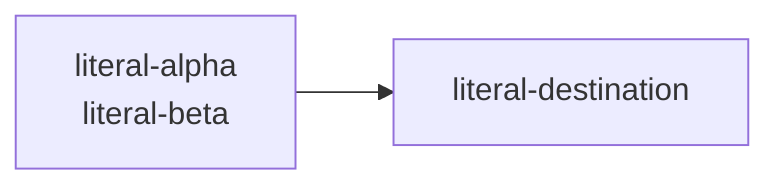
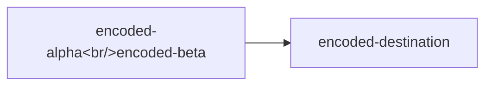

# Synthetic Mermaid rendering boundary preflight

Control:

```mermaid
flowchart LR
  A["control-alpha"] --> B["control-beta"]
```

Literal tag representation:

```mermaid
flowchart LR
  A["literal-alpha<br/>literal-beta"] --> B["literal-destination"]
```

Encoded tag representation:

```mermaid
flowchart LR
  A["encoded-alpha&lt;br/&gt;encoded-beta"] --> B["encoded-destination"]
```
